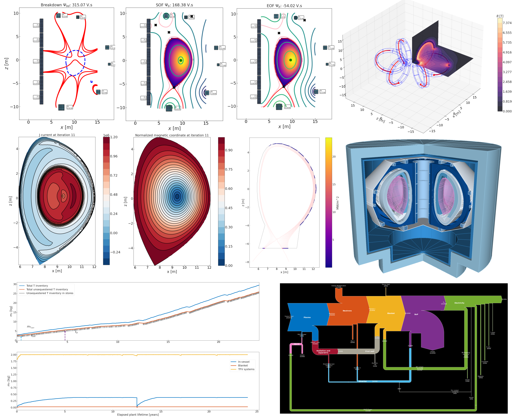

[](https://bluemira.readthedocs.io/en/develop) [](https://codecov.io/gh/Fusion-Power-Plant-Framework/bluemira)


# Bluemira




``Bluemira`` is an integrated inter-disciplinary design tool for future fusion reactors. It
incorporates several modules, some of which rely on other codes, to carry out a range of
typical conceptual fusion reactor design activities.

``Bluemira`` was created from two similar codes: ``BLUEPRINT`` and ``MIRA`` (see
[publications](#publications)).

## Work in Progress!

The `bluemira` team has been working hard since mid-2021 to combine ``BLUEPRINT`` and ``MIRA`` into a single reactor design framework. We took the opportunity to embark upon
a significant refactor of both code bases, delivering improved functionality, code
quality, and hopefully maintainability. This, along with some resourcing issues has
caused our feature roadmap to slip. A lot of functionality that was present in  ``BLUEPRINT`` and ``MIRA`` is not yet available in `bluemira`.

`Bluemira` is very much under active development, and will likely be subject to API
changes in the near future. We apologise in advance for these. Please do get in touch
before starting to use any modules, so we can warn you of changes to come.

Below is an overview of our development roadmap for 2022:


## Modules

``Bluemira`` is composed of various modules:

* `balance_of_plant`: power balance solver and tools
* `base`: the software backbone of the ``bluemira`` framework
* `codes` **[WIP]**: interfaces to external codes (both API and file PI)
* `display`: plotting and display module
* `equilibria`: equilibrium solvers and objects
* `fuel_cycle`: fuel cycle model
* `geometry`: the geometry "engine" of the ``bluemira`` framework
* `magnetostatics`: magnetostatics solvers
* `materials`: materials module
* `plasma_physics`: 0-D plasma physics tools
* `radiation_transport` **[WIP]**: radiation and advection transport solvers
* `structural` **[WIP]**: beam finite element structural solver
* `utilities`: collection of utility toolboxes for file IO, databases,
  machine learning, and misc.

## Publications

The ``bluemira`` code and its modules are described in the following publications:

* TBD

As ``bluemira`` is the result of an integration between two historical codes,
some previous publications may also be of interest.

The ``BLUEPRINT`` code and its modules are described in the following publications:

* [BLUEPRINT: A novel approach to fusion reactor design, Coleman and McIntosh, *Fusion Engineering and Design* v **139** pp 26-38 (2019)](https://www.sciencedirect.com/science/article/pii/S0920379618308019)
* [DEMO tritium fuel cycle: performance, parameter explorations, and design space constraints, Coleman, Hörstensmeyer and Cismondi, *Fusion Engineering and Design* v **141** pp79-90 (2019)](https://www.sciencedirect.com/science/article/pii/S092037961930167X)
* [The design and optimisation of tokamak poloidal field systems in the BLUEPRINT framework, Coleman and McIntosh, *Fusion Engineering and Design* v **154** 111544 (2020)](https://doi.org/10.1016/j.fusengdes.2020.111544)
* [High-speed generation of neutronics-ready CAD models for DEMO design, Coleman, Shimwell, Davis, and McIntosh, *Fusion Engineering and Design* v **160** 112043 (2020)](https://www.sciencedirect.com/science/article/pii/S0920379620305913)

The ``MIRA`` code and its modules are described in the following publications:

* [On the implementation of new technology modules for fusion reactor systems codes, Franza, Boccaccinni, Fischer, Gade, and Heller, *Fusion Engineering and Design*, v **98-99** pp 1767-1770 (2015)](https://www.sciencedirect.com/science/article/pii/S0920379615001933)
* [Development of an advanced magnetic equilibrium model for fusion reactor system codes, Franza, Landman, and Petschanyi, *Fusion Engineering and Design*, v **136** pp 309-313 (2018)](https://www.sciencedirect.com/science/article/pii/S0920379618301157)
* [Development and Validation of a Computational Tool for Fusion Reactors' System Analysis, Franza, Ph.D thesis, Karlsruher Institut f&uuml;r Technologie (2019)](https://publikationen.bibliothek.kit.edu/1000095873)
* [MIRA: a multi-physics approach to designing a fusion power plant, Franza, Boccaccini, Fable, Landman, Maione, Petschanyi, Stieglitz and Zohm, *Nuclear Fusion*, v **62** 076042 (2022)](https://iopscience.iop.org/article/10.1088/1741-4326/ac6433)

## Terms of use

``Bluemira`` is [released under the LGPLv2.1 license](LICENSE), but we also ask that
you show professional courtesy when using this code:

1. Since you are benefiting from work on ``bluemira``, we ask that you submit any
   improvements you make to the code to us by submitting a pull request to this
   repository. If you are looking to develop aspects of this code or add parts to it,
   please contact us beforehand so that we can help/advise if necessary.

2. If you use ``bluemira`` results in a paper or professional publication, we ask that
   you discuss your work and results with one of the ``bluemira`` authors first so that
   we can check them. It is not necessary to list ``bluemira`` developers as co-authors.
   If one or more of the ``bluemira`` team are involved in preparing results or
   new functionality used in your work, then those members should be offered a co-authorship.

3. If you use ``bluemira`` or any of its modules in your work, please help ensure that
   all the authors get the credit they deserve by citing the relevant ``bluemira``,
   ``BLUEPRINT``, and ``MIRA`` papers.

For a full list of existing publications, see [here](#publications).

## Code of conduct

See [code of conduct](CODE_OF_CONDUCT.md).

## Installation

See our [installation guide](https://bluemira.readthedocs.io/en/develop/installation.html).

## Developing

For working on ``bluemira`` you will also need to install the development dependencies
and the git pre-commit hook:

```shell
python -m pip install --no-cache-dir  -e .'[dev]'
pre-commit install -f
```

Please see the [guidelines for contributing to bluemira](CONTRIBUTING.md).

In addition to the dependencies for installation, the following tools are useful for
developing ``bluemira``:

* Sphinx
* Black

Tests are run with `pytest`. To run the unit tests:

```shell
pytest
```

---

If you don't have ``PROCESS`` installed then you'll need to edit
`tests/test_reactor.py`.

Change the line `"process_mode": "read"` to `"process_mode": "mock"`.

For more information on PROCESS please see [here](https://ccfe.ukaea.uk/resources/process/)

---

To run all the tests:

```shell
pytest --reactor --longrun --plotting-on
```

`pytest` also supports running individual test files and selecting tests by name or
using a regular expression. See the
[pytest documentation](https://docs.pytest.org/en/latest/usage.html).

After a test run an html report of the results can be found in `report.html`. A test
coverage report can be found in the `htmlcov` directory.

## Building Documentation

The documentation is built with Sphinx. In addition the API documentation is created by
`sphinx-apidoc`.

To build the html documentation execute this command:
```shell
sphinx-build documentation/source documentation/build
```

New pages can be added by adding them to the `documentation/source` directory and adding
a link in the `toctree` section of `index.rst`.  The index page lives at
`documentation/build/index.html`. API documentation will be automatically generated from
the ``bluemira`` source code.
